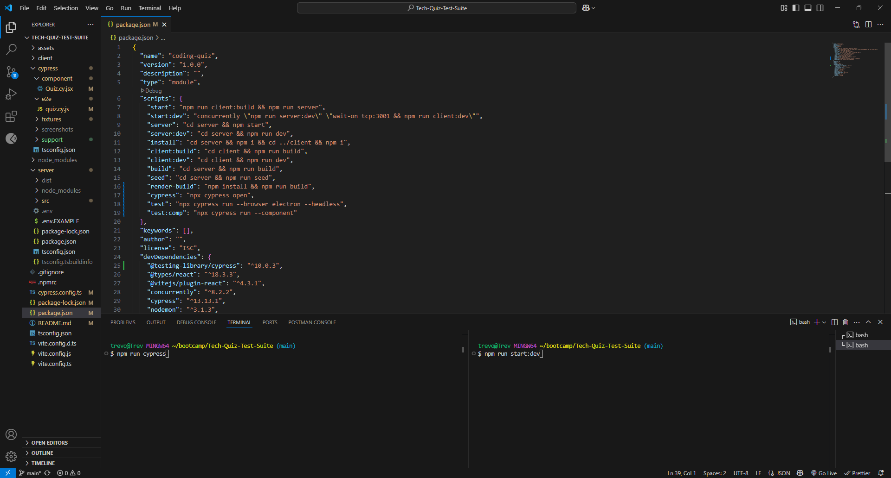
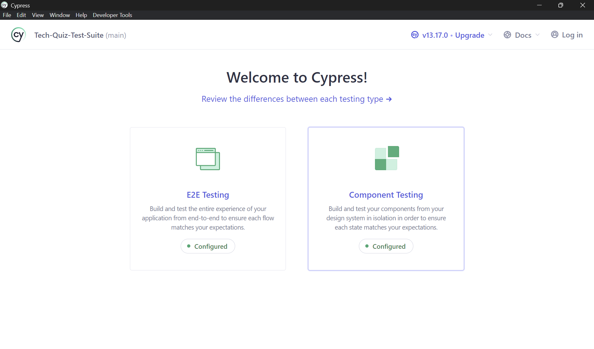
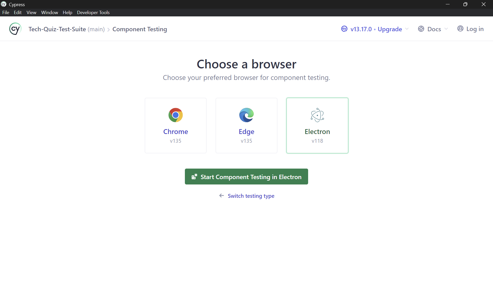
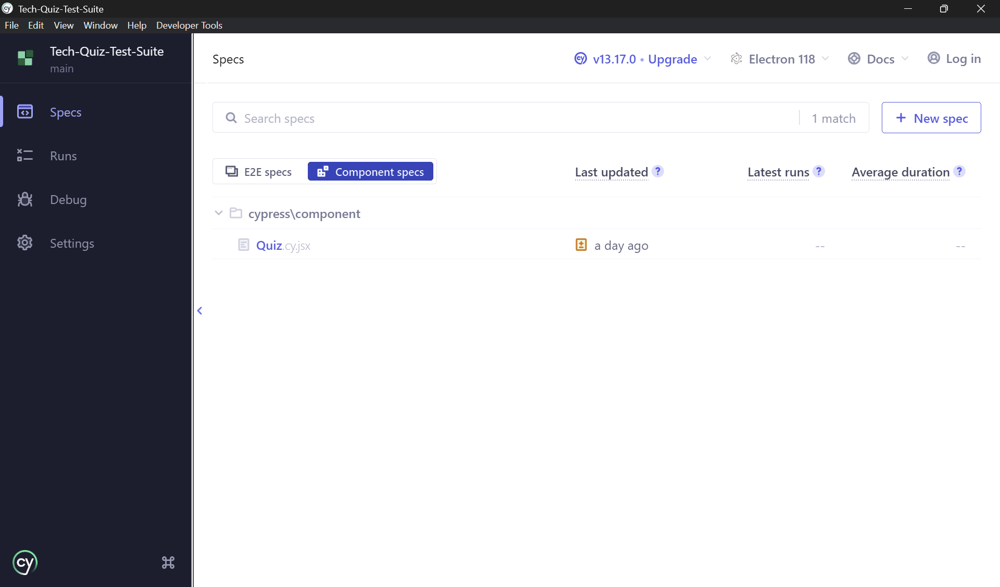
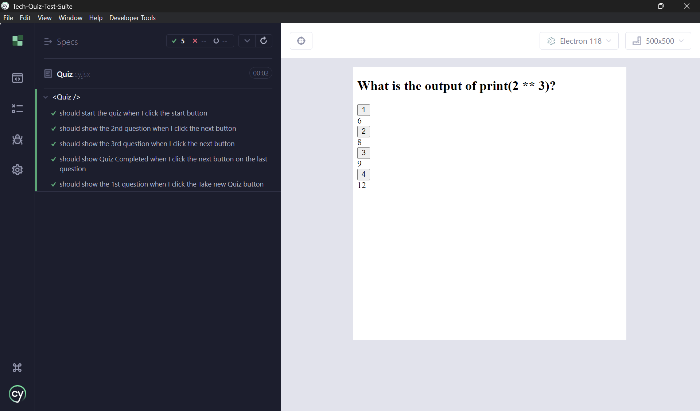
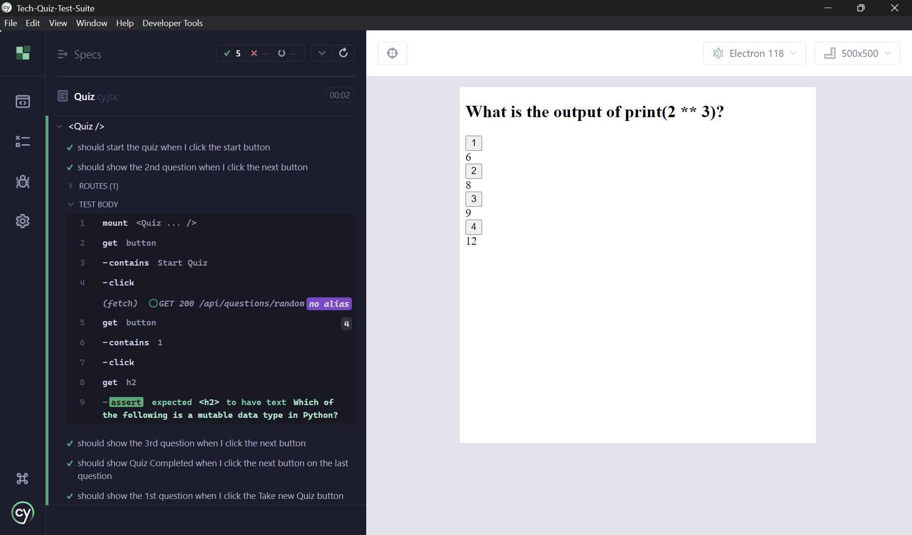
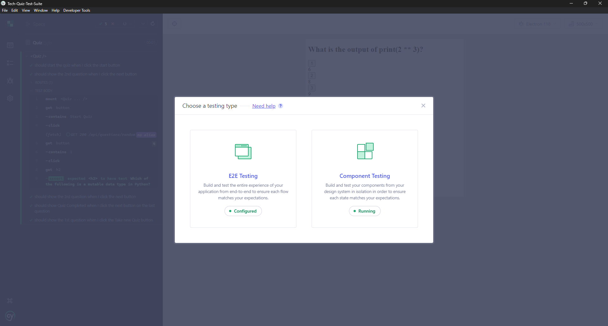
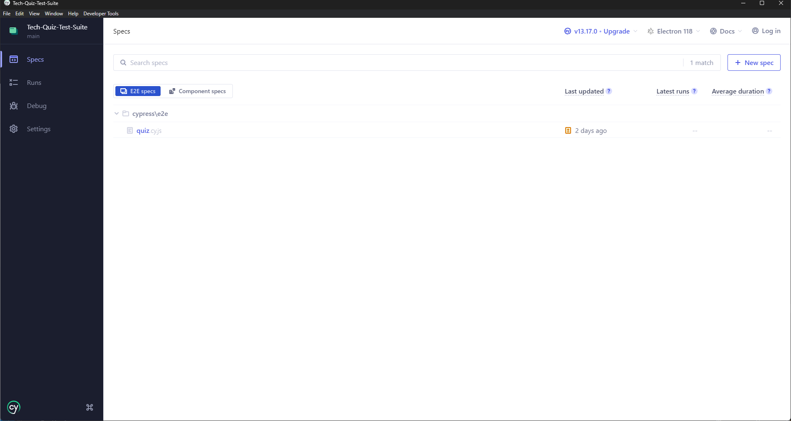
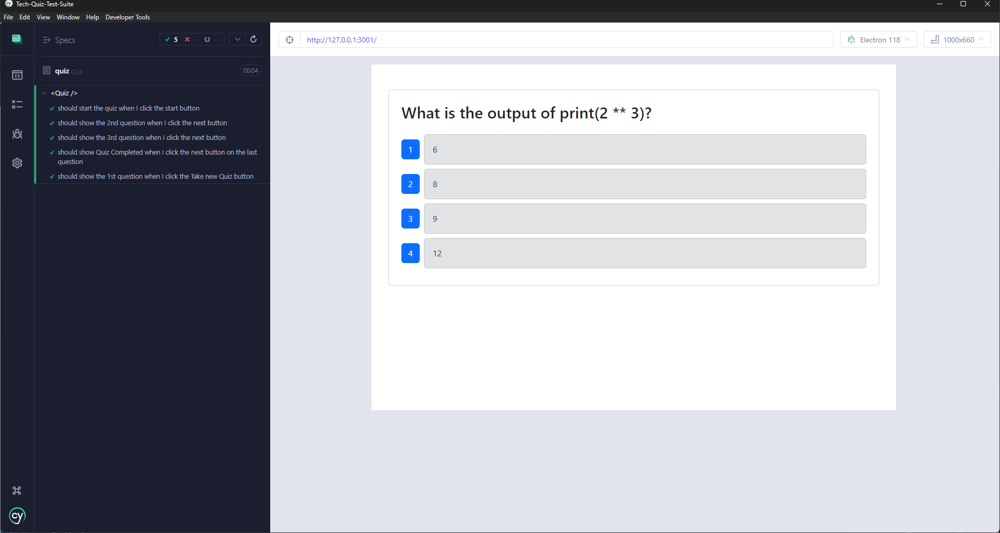
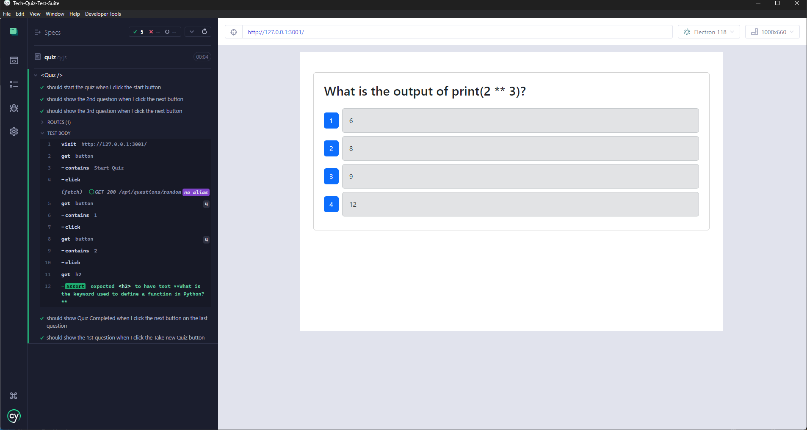

# Tech-Quiz-Test-Suite
  

  ## Description
  In today's dynamic development environment, testing is not just an afterthought but a critical part of ensuring reliability and robustness in modern web applications. The Tech Quiz Test Suite project focuses on enhancing a fully functioning Tech Quiz application by integrating Cypress testing for both component and end-to-end validations. The application is built using the MERN stack, with a React front end, a MongoDB database, and a Node.js/Express.js server and API. It allows users to take a tech quiz consisting of ten random questions and view their final score, ensuring the experience is stable and user-friendly through comprehensive automated testing.

  ## Table of Contents
  - [Installation](#installation)
  - [Usage](#usage)
  - [Technologies](#technologies)
  - [Screenshots](#screenshots)
  - [Walkthrough Video](#walkthrough-video)
  - [URL Link](#url-link)
  - [Contributing](#contributing)
  - [Contributors](#contributors)
  - [Tests](#tests)
  - [License](#license)
  - [Questions](#questions)

  ## Installation
  
  1. Git clone: git@github.com:Treevyy/Tech-Quiz-Test-Suite.git

  2. Navigate to the project directory: cd Tech-Quiz-Test-Suite

  3. Right click the root package.json file and click open in integrated terminal

  4. Inside the terminal install the dependencies with the command: npm i

  5. After your dependencies are installed run the command: npm run build

  6. After dependencies are installed and your app is built run the application with two different commands in two different termianls because they need to run at the same time. In your first terminal run the command: npm run cypress and in a new terminal run the command: npm run start:dev this will allow you to run and test the application.

  ## Usage
  To run the Tech Quiz application:

  1. Launch the app with the command: npm run cypress

  2. After you launch a Cypress window will pop up, and you will be promted with two testing choices with E2E Testing (also known as end to end testing) or Component Testing select what you would like to test.

  3. Once you choose a test you will be asked to choose a browser select the green button that says Start E2E testing in Electron or Start Component Testing in Electron depenind on which test you choose to do, and a new window will pop up.

  4. Inside this new windown in Cypress you can now test you E2E or Componets you also have the ability to switch between the two diffent types of test here as well, and this is where you can run your test by running the command in the root level: npm run cypress

  5. Your test will show on the left hand side of the page and you can expand and show the result if it passed it will show green and if it failed it will show red.

  6. To test your E2E and Components you have to run it locally first for the test to start by using this command in the root level: npm run cypress, and while that is running you also need to run your server by opening a new termianl and run the command: npm run start:dev
  
  7. If your test fails inside E2E testing rewrite your code inside the Cypress folder make sure it has the correct port you are running your server on it should look something like this cy.visit("http://127.0.0.1:3001/") Also make sure your fixtures have the right content inside it, mines a quiz so it contains questions. Nagigate to the E2E folder and select the file that needs work. In my case I worked on the quiz.cy.js you can make changes here to adjust your E2E testing until everything you want to test is passed.
  
  8. If your test fails inside Componet testing rewrite your code inside the Cypress folder select the Components folder and select the file that needs work. In my case I worked on the Quiz.cy.jsx you can make changes here to adjust your Compnent testing until everything you want to test passed. For componets you want to make sure its mounted should look like this cy.mount(<Quiz />) also make sure your fixtures are completed again mine is a quiz so its full of questions.

  ## Technologies

 ### Frontend
 

### Backend

  ## Screenshots
  
  

  

  

  

  

  

  

  

  

  

  ## Walkthrough Video
  A demo of the application can be found at the following link: https://drive.google.com/file/d/15DaVA2Tb-8K8FmawfDwR8JZpidLSvb8Q/view

  ## URL Link
  There is no URL link to this application
  
  ## Contributing
  No contributions are needed for this project

  ## Contributors
  Thank you to all the TA's, Tutors and professor for all your help completing this challenge

  1. Trevor Moore aka Treevyy

  2. Ainsley - Tutor

  3. Joem Casusi - Turor

  4. Dan Mueller - Professor

  ## Tests
 The Tech Quiz Test Suite uses Cypress for component and end-to-end testing.
 
 To run tests:

  1. To test the E2E and Components run two seperate terminals at the root level in the first terminal run the command: npm run cypress and in the second terminal run the command npm run start:dev

  2. Select and run the Component Tests, select Start Componet Testing in Electron, then select the componet in this case my componet is quiz.cy.jsx.

  3. All tests should pass successfully to ensure robust functionality. If not your code needs to be modified in vscode the file path will like like this cypress > componet > Quiz.cy.jsx

  4. Once all your componet test pass inside the same window in cypress there is a green square button select that and it will tell you which test is running and which is configured select your E2E testing to run that next.

  5. On your E2E testing select the quiz.cy.js to start running your E2E testing

  6. All tests should pass successfully to ensure robust functionality. If not your code needs to be modified in vscode the file path will like like this cypress > e2e > quiz.cy.js

  ## License
  This project is licensed under the MIT license.

  ## Questions
  If you have any additional questions, you can contact me at:
  - GitHub: [Treevyy](https://github.com/Treevyy)
  - Email: [aarontrevormoore@gmail.com](mailto:aarontrevormoore@gmail.com)
